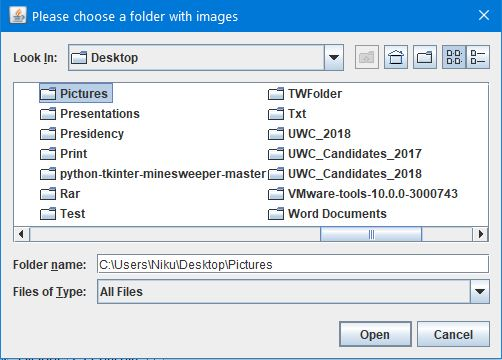
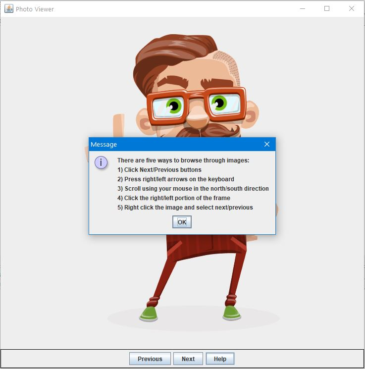

# Image-Viewer
Basic image viewer that lets you open and browse through images. The user has to first select a folder with images to be displayed.
There is five different ways to scroll through the images, which is illustrated in the image below.

To run the project, simply run Driver.java that contains the main method.

## How to use
### 1. Select a folder with images

### 2. Image viewer interface appears

### 3. Press the help button for instructions how to navigate through images

